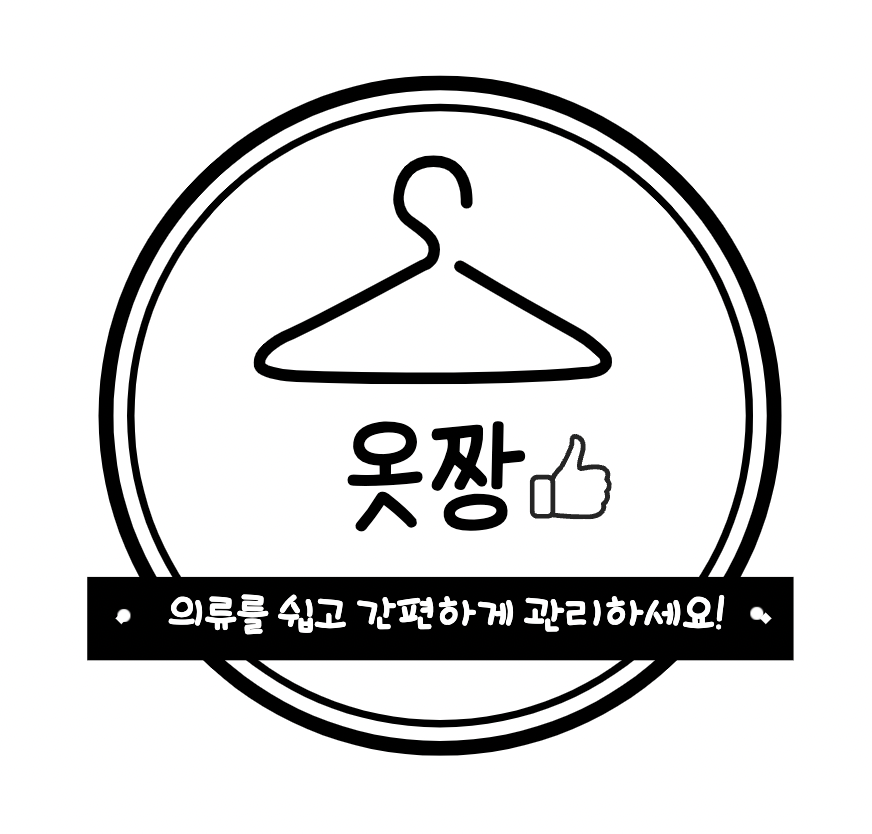
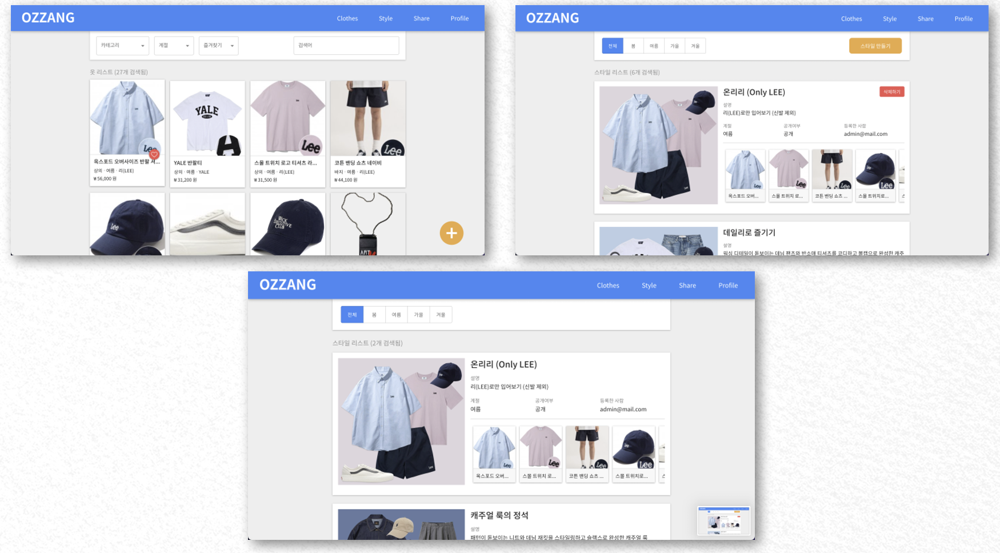

# 소프트웨어 공학 6조

## 프로젝트

**의류 관리 프로그램**

<!-- {width=40%} -->

## 프로젝트 개요

22학년도 1학기 소프트웨어 공학 2분반 실습 프로젝트입니다.  
사계절별로 옷차림이 달라지고 다양한 의류를 보관해야 할 필요가 생깁니다.  
또한, 자신이 가지고 있는 옷이 무엇이 있는지 모두 기억하기 어려운 경우가 많습니다.  
이 프로젝트는 사용자가 자신의 의류를 카테고리별로 분류할 수 있도록,  
사진을 포함해 관리할 수 있도록 도와줍니다.

### 프로젝트 팀원

> | 학번      | 이름 (학과)           | 비고 |
> | --------- | --------------------- | ---- |
> | 201811432 | 나주엽 (컴퓨터과학과) | 팀장 |
> | 201810933 | 문정호 (컴퓨터과학과) |      |
> | 201810949 | 송수근 (컴퓨터과학과) |      |
> | 201810978 | 이주헌 (컴퓨터과학과) |      |
> | 201810995 | 정용훈 (컴퓨터과학과) |      |

---

### 사용한 기술

- React.js
- node.js
- express.js
- MongoDB
- AWS S3

#### 링크

